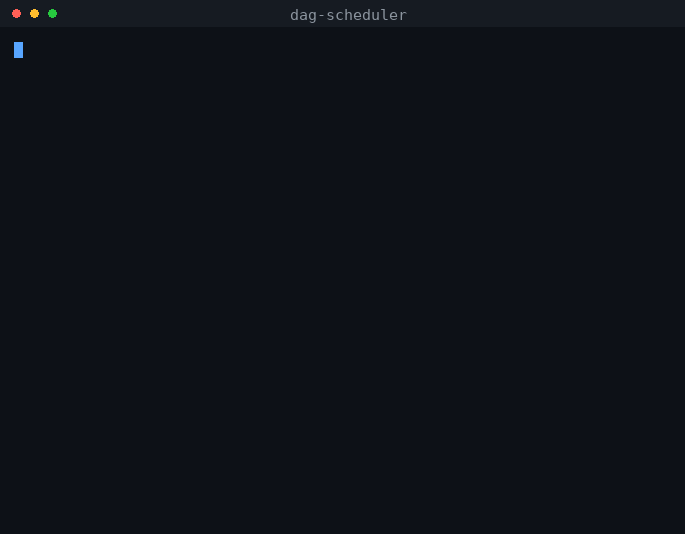
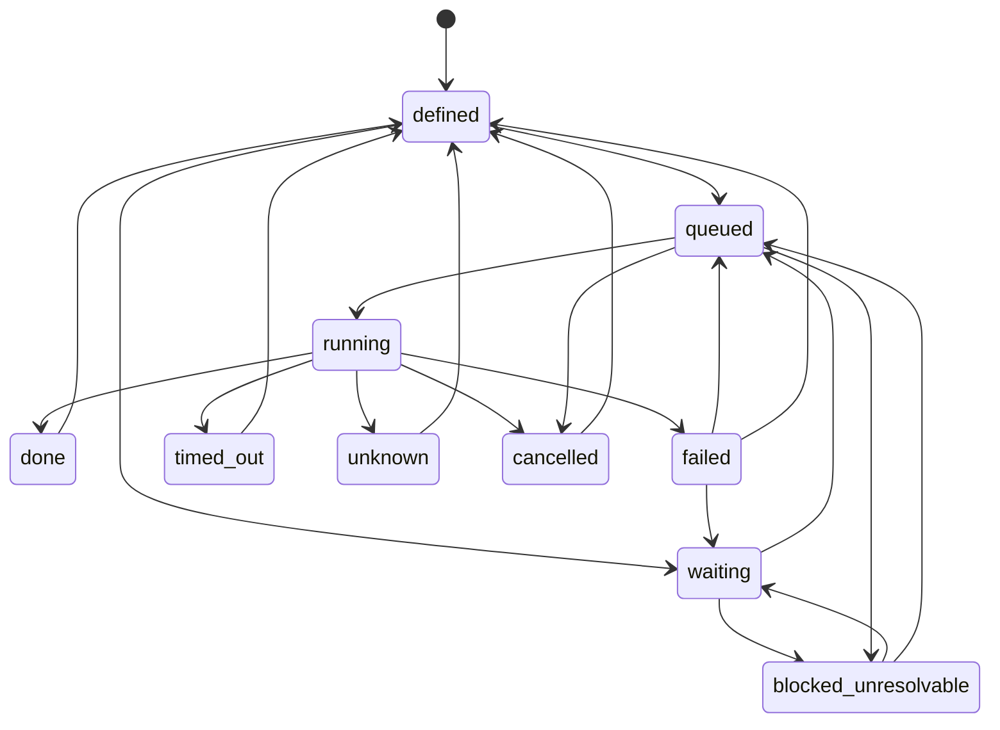
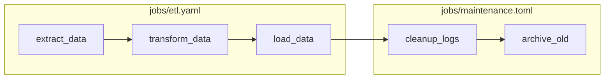

# DAG Scheduler

A single-node job scheduler daemon. You describe jobs and their dependencies
in YAML or TOML, drop the files in a directory, and the daemon runs them in
dependency order as subprocesses, with retries, timeouts, priority, a REST
API and a CLI.

It exists to occupy the gap between cron and a distributed workflow engine.
Cron has no concept of one job depending on another, and no memory of
whether last night's run succeeded. Airflow and its peers answer that, and
bring a scheduler process, a metadata database, a web server and a
deployment story with them. This is the smallest thing that still gives you
a dependency graph, bounded retries, timeout enforcement and a record of
what happened: one process, one SQLite file, no broker.

Requires Python 3.11 or newer, for `tomllib`, and a POSIX system: Linux,
macOS, or WSL on Windows.

The POSIX requirement is not incidental. Jobs are spawned in their own
process group and killed with `os.killpg`, so that a timeout or a cancel
takes down the whole job rather than leaving its children orphaned under a
dead shell. Shutdown installs asyncio signal handlers. Neither has a
Windows equivalent. Running the test suite on Windows reports 14 skips for
exactly these behaviours.



The run above is real output. A three-stage chain runs in dependency order,
`always_fails` retries exactly three times and stops, and `slow_job` is
killed when it exceeds its timeout with no orphaned process left behind.

---

## Install and run

```bash
git clone https://github.com/vimalmathew26/dag_scheduler
cd dag_scheduler
python -m venv .venv && source .venv/bin/activate
pip install -e ".[dev]"
```

Start the daemon. It listens on `127.0.0.1:8000` and loads job definitions
from the `jobs/` directory:

```bash
dag-scheduler daemon
```

In a second terminal, run the example pipeline:

```bash
dag-scheduler status
dag-scheduler trigger extract_data
dag-scheduler status
```

`extract_data` runs, then `transform_data`, then `load_data`, then
`cleanup_logs` and `archive_old` from a second file. Each becomes `queued`,
then `running`, then `done`, and completing unblocks whatever depends on it.

```bash
dag-scheduler runs extract_data     # run history with attempt numbers
dag-scheduler logs extract_data     # stdout and stderr of the latest run
dag-scheduler stats                 # pass rate and job counts
```

Three of the shipped definitions exist to demonstrate failure handling:

```bash
dag-scheduler trigger always_fails  # exits 1, retries exactly 3 times with backoff
dag-scheduler trigger slow_job      # sleeps 30s with a 2s timeout, killed and marked timed_out
```

`jobs/cycle.yaml` declares a mutual dependency. It is rejected at load time
and you will see the rejection in the daemon log; neither job appears in
`dag-scheduler status`.

### Where state lives

The database is at `$XDG_DATA_HOME/dag_scheduler/scheduler.db`, defaulting to
`~/.local/share/dag_scheduler/scheduler.db`. Delete that file to start clean.

This directory was called `genie_dag` in earlier versions. If you have an
old database, either move it or let a new one be created.

### Running the tests

```bash
pytest                       # 470 tests, 14 skipped off POSIX
ruff check . && mypy .
```

---

## Writing a job definition

```yaml
jobs:
  extract_data:
    command: "echo extract_data && exit 0"
    depends_on: []
    tags: ["etl", "daily"]
    priority: 5
    timeout: 120
    retry:
      max_attempts: 3
      backoff_base: 2.0
      jitter: true
      retry_on_exit_codes: [1, 2]
```

`command` is the only required field. Job names live in one flat namespace
across every file in the directory, so `depends_on` can reference a job
defined in another file, in either format.

Changes to the directory are picked up without a restart. A name defined in
two files is rejected on both sides rather than one winning arbitrarily, and
a job whose dependency cannot be resolved does not load.

**Job definitions are executed as shell commands by the daemon's user.**
Anyone who can write to the jobs directory can run arbitrary code. That, not
the API, is the privilege boundary worth thinking about.

---

## Architecture

| Component | File | Responsibility |
|---|---|---|
| **Daemon** | `__main__.py` | Bootstraps all components, manages lifecycle and signal handling |
| **Persistence** | `persistence.py` | SQLite (WAL mode) storage for jobs, runs, and logs; enforces state machine transitions |
| **Registry** | `registry.py` | In-memory job namespace; handles hot-reload swaps and diffing |
| **DefinitionParser** | `definition_parser.py` | Parses YAML/TOML job files in three passes with cycle detection |
| **DAG** | `dag.py` | Topological sort (Kahn's algorithm), cycle detection, dependency fan-out |
| **Scheduler** | `scheduler.py` | Main polling loop; claims and dispatches queued jobs, manages priority aging |
| **Executor** | `executor.py` | Runs subprocesses with concurrency semaphore, timeout enforcement, log streaming |
| **RetryEngine** | `retry_engine.py` | Exponential backoff with jitter; decides whether to retry based on exit codes |
| **ProcessManager** | `process_manager.py` | Tracks live subprocess handles; crash recovery; process group termination |
| **LogStore** | `log_store.py` | Stores and retrieves stdout/stderr chunks per job run |
| **FileWatcher** | `file_watcher.py` | Watches the jobs directory via `watchdog` and triggers registry reload |
| **API** | `api.py` | FastAPI REST endpoints for status, triggering, cancellation, logs, and stats |
| **CLI** | `cli.py` | Click-based CLI that talks to the API |
| **Config** | `config.py` | Central constants (paths, concurrency, defaults, ports) |

### Component dependency graph

```
Daemon
 ├── Persistence
 ├── LogStore
 ├── ProcessManager ──► Persistence
 ├── Registry ──► Persistence, DefinitionParser ──► DAG
 ├── Executor ──► Persistence, ProcessManager, LogStore, RetryEngine
 ├── Scheduler ──► Persistence, Registry, Executor
 ├── RetryEngine ──► Scheduler
 ├── FileWatcher ──► Registry
 └── API ──► Scheduler, Registry, Persistence, LogStore
```

---

## Data model

Defined in `models.py`:

- **`JobState`** a 10-state enum: `defined`, `waiting`, `queued`, `running`,
  `done`, `failed`, `timed_out`, `unknown`, `cancelled`,
  `blocked_unresolvable`
- **`RetryPolicy`** `max_attempts`, `backoff_base`, `jitter`,
  `retry_on_exit_codes`
- **`JobDefinition`** `command`, `depends_on`, `tags`, `priority`, `timeout`,
  `retry`
- **`JobRun`** `job_name`, `run_id`, `state`, `start_time`, `end_time`,
  `exit_code`, `attempt`
- **`DefinitionFile`** top-level wrapper with a jobs dict

### State machine

`Persistence.VALID_TRANSITIONS` holds all 21 legal transitions and is the
authoritative definition. Every other ordered pair raises
`InvalidTransitionError`, which the test suite asserts exhaustively across
all 100 pairs.



The transitions back to `defined` are how a terminal job becomes runnable
again: `enqueue_job` resets before re-queueing, which is what makes both
retries and manual re-triggers legal.

`unknown` means the daemon cannot say what happened, which is distinct from
`failed`. It is what a job becomes when the daemon dies while it was
running.

### Database schema

| Table | Purpose |
|---|---|
| `jobs` | Job definitions, current state, priority, current attempt |
| `job_runs` | Individual execution records per job |
| `job_logs` | Stdout/stderr chunks per run |

---

## Key workflows

### Startup

1. Create the data directory and initialise the schema
2. Crash recovery: mark orphaned `running` jobs `unknown`, and finalize any
   `job_runs` rows left mid-flight by a previous lifetime
3. Load job definitions from the jobs directory
4. Start the scheduler polling loop and priority aging loop
5. Start the file watcher
6. Start the API server

### Definition parsing

Three passes:

1. Read every file in sorted order and collect each declaration with the
   file it came from. A name declared in more than one file is rejected on
   every side; keeping one would need an arbitrary precedence rule.
2. Resolve dependency references. A job naming a dependency that does not
   exist is dropped, and the removal cascades to its dependents.
3. Cycle detection via `topological_sort`. Jobs participating in a cycle are
   dropped individually, and removal cascades.

Failures are per-job wherever possible, and are reported as warnings in the
daemon log rather than aborting the load, so one bad definition cannot stop
the rest from loading.

### Scheduling

The loop claims the highest-priority queued job with a single atomic
statement that also marks it running, so a job is dispatched exactly once.
It does not claim while the executor is at its concurrency limit
(`MAX_CONCURRENT`, 4).

Priority aging promotes jobs that have already waited longer than
`PRIORITY_AGING_INTERVAL`, so a job accumulates priority in proportion to
how long it has been queued and a job queued a moment ago accumulates none.
A low-priority job that has been starved will eventually overtake newer
high-priority work.

### Execution

1. Acquire a concurrency slot
2. Spawn the command via `asyncio.create_subprocess_shell` in its own
   process group
3. Stream stdout and stderr to the log store
4. Enforce the timeout; on expiry, SIGTERM the process group, then SIGKILL
   after `GRACEFUL_KILL_TIMEOUT`
5. On exit code 0, mark `done` and unblock dependents
6. On any other exit code, mark `failed` and hand to the retry engine

### Retries

`should_retry` requires both that the attempt number is below
`max_attempts` and that the exit code is listed in `retry_on_exit_codes`.
Backoff is `backoff_base ** attempt`, with optional jitter of plus or minus
20 percent. The attempt number is stored on the job, so it survives the
round trip back through the queue.

### Hot reload

The file watcher triggers a reload, which reparses the directory and diffs
the result against the current snapshot. Jobs that were removed and are
queued or waiting become `blocked_unresolvable` rather than being deleted;
running jobs are left to finish.

### Dependency fan-out

When a job finishes `done`, its direct dependents are checked. A dependent
becomes `queued` only when every name in its `depends_on` is present in the
current snapshot and is `done`. A dependency that no longer exists makes the
condition unsatisfiable, not satisfied, so the dependent stays blocked.

---

## Configuration

Anything that changes per deployment reads from the environment. Everything
else is a constant in `config.py`, deliberately.

| Variable | Default | Meaning |
|---|---|---|
| `DAG_SCHEDULER_JOBS_DIR` | `./jobs` | Where definitions are read from |
| `DAG_SCHEDULER_DB` | `$XDG_DATA_HOME/dag_scheduler/scheduler.db` | Database file |
| `DAG_SCHEDULER_MAX_CONCURRENT` | `4` | Jobs running at once |
| `DAG_SCHEDULER_HOST` | `127.0.0.1` | API bind address |
| `DAG_SCHEDULER_PORT` | `8000` | API port |
| `DAG_SCHEDULER_TOKEN` | unset | Bearer token required on trigger, cancel and reset |
| `DAG_SCHEDULER_AGING_INTERVAL` | `60` | Seconds between priority aging passes |
| `DAG_SCHEDULER_LOG_LEVEL` | `INFO` | Log level |
| `DAG_SCHEDULER_LOG_JSON` | unset | Emit one JSON object per line |
| `DAG_SCHEDULER_API_URL` | `http://127.0.0.1:8000` | Where the CLI looks for the daemon |

### Security

The daemon binds loopback by default, so it is not reachable off the
machine as shipped. Setting `DAG_SCHEDULER_TOKEN` requires
`Authorization: Bearer <token>` on the three mutating endpoints; reads stay
open. The daemon logs a warning at startup when it is running
unauthenticated, and another when bound to a non-loopback address.

That is the whole of it, on purpose. There are no users and no roles,
because the API is not where the privilege lives. Commands never arrive
over HTTP: `trigger` only names a job that already exists, and the command
it runs came from a file on disk. The boundary that matters is write access
to the jobs directory, because definitions are executed as shell commands
by the daemon's user.

### Observability

Every log line emitted during a job run carries the job name, run id and
attempt number, so one filter returns the whole run:

```bash
DAG_SCHEDULER_LOG_JSON=1 dag-scheduler daemon | jq 'select(.run_id == "...")'
```

`/metrics` serves Prometheus text: dispatch count, runs by terminal state,
retries, reload failures, dispatch loop errors, and live gauges for running
and queued jobs.

---

## API

Served on `127.0.0.1:8000`.

| Method | Path | Description |
|---|---|---|
| `GET` | `/` | Root message |
| `GET` | `/health` | Alive check |
| `GET` | `/jobs` | List all jobs (filter by `state`, `tag`) |
| `GET` | `/jobs/{job_id}` | Job detail and last run summary |
| `GET` | `/jobs/{job_id}/runs` | Run history, newest first |
| `GET` | `/jobs/{job_id}/runs/{run_id}/logs` | Stdout and stderr for a run |
| `POST` | `/jobs/{job_id}/trigger` | Force-queue, bypassing dependencies. Token required |
| `POST` | `/jobs/{job_id}/cancel` | Cancel a queued or running job. Token required |
| `POST` | `/jobs/{job_id}/reset` | Return a terminal job to `defined`. Token required |
| `GET` | `/stats` | Aggregate stats |
| `GET` | `/metrics` | Prometheus text exposition |

`/stats` reports durations at one-second resolution, because run timestamps
are stored to the second. Jobs that finish in under a second report a
duration of zero.

---

## CLI

| Command | Description |
|---|---|
| `dag-scheduler daemon` | Run the scheduler daemon in the foreground |
| `dag-scheduler status` | Show all jobs and states |
| `dag-scheduler trigger <name>` | Force-queue a job |
| `dag-scheduler cancel <name>` | Cancel a queued or running job |
| `dag-scheduler reset <name>` | Return a terminal job to `defined` |
| `dag-scheduler logs <name>` | Show logs for the most recent run |
| `dag-scheduler runs <name>` | Show run history |
| `dag-scheduler stats` | Show aggregate statistics |
| `dag-scheduler load <path>` | Copy a definition file into the jobs directory |

---

## Example definitions



Job names share one flat namespace, so `cleanup_logs` in a TOML file can
depend on `load_data` from a YAML file. That is the cross-file edge above.

| File | Demonstrates |
|---|---|
| `jobs/etl.yaml` | A three-stage chain: `extract_data`, `transform_data`, `load_data` |
| `jobs/maintenance.toml` | `cleanup_logs` and `archive_old`, depending across files and formats |
| `jobs/failing.yaml` | `always_fails` exits 1 and retries exactly 3 times with no jitter |
| `jobs/slow.yaml` | `slow_job` sleeps 30s with a 2s timeout |
| `jobs/cycle.yaml` | A mutual dependency, rejected at load time |
